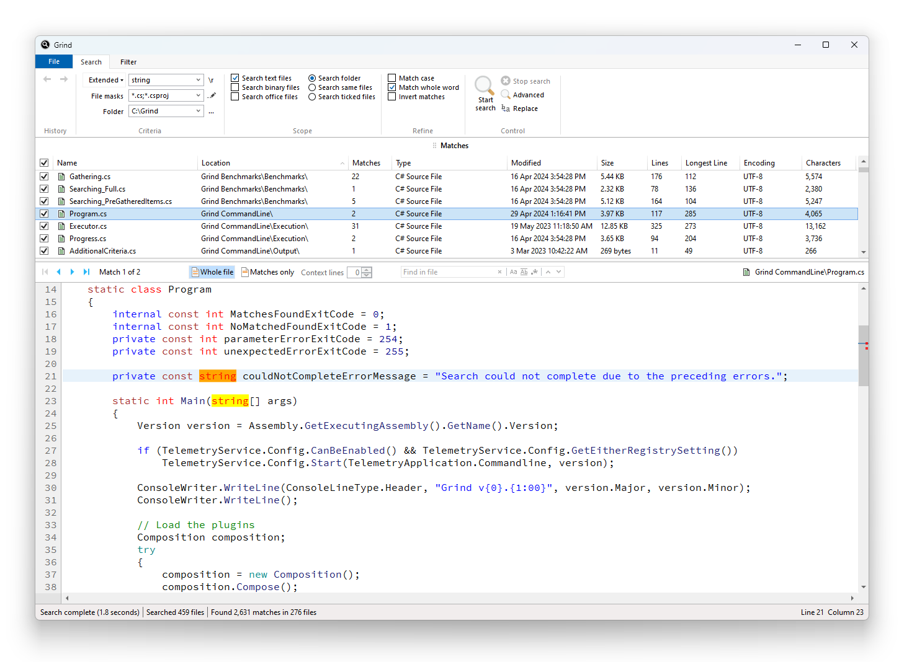

## Grind

[Download Grind v1.50](https://github.com/Arjailer/arjailer.github.io/releases/download/Grind/Grind.Setup.exe)
 
(4 March 2024, ~11.6MB)

_Grind needs [.Net 8 Desktop Runtime](https://dotnet.microsoft.com/en-us/download/dotnet/8.0), on Windows 10 version 1809 or later_

 

---

_[Grind v1.41](https://github.com/Arjailer/arjailer.github.io/releases/download/Grind-dotnet-4/Grind.Setup.v1.41.exe) is the last version that used the [.NET Framework 4.8 Runtime](https://dotnet.microsoft.com/download/dotnet-framework), and runs on Windows 7 or later_

---

 

Grind is a visual grep tool for Windows.

I started writing it in early 2012 as a simple, fast search tool for my own use. It's become quite popular amongst the developers where I work, and I still work on it from time to time.

