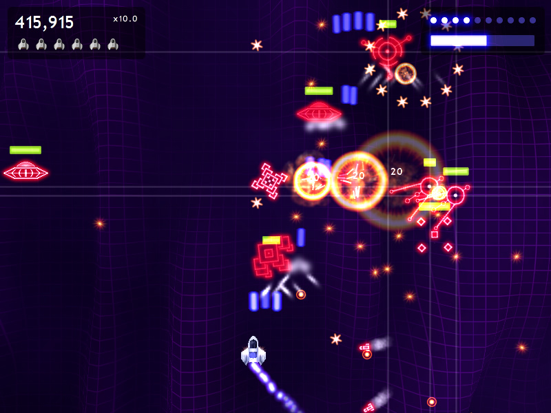

## Gun Wing

Gun Wing is a simple little shoot-em-up for Windows that I wrote in [Blitz3D](https://blitzresearch.itch.io/blitz3d) in my spare time back in 2007.

It didn't turn out to be as much fun as I'd hoped but I learned a lot writing it.

  

---

<strong>Gun Wing v1.1</strong> 
February 2007

[Download](https://github.com/Arjailer/arjailer.github.io/releases/download/GunWing/GunWing.Setup.exe) 
6 MB

_Gun Wing itself should run on anything from Windows 95 onward, but the installer only supports Windows XP or later_

  

<strong>Windows SmartScreen</strong> 
Note that due to the costs involved the Gun Wing installer is unsigned, and therefore running the installer will probably trigger <strong>Windows SmartScreen</strong>. 
Depending how Windows is configured you may have to click <strong>More Info</strong> then <strong>Run Anyway</strong> to start the installer, or it may block the installer entirely. 
If this happens you can unblock the installer by running the following command in PowerShell: 
<code>Unblock-File "$((New-Object -ComObject Shell.Application).NameSpace('shell:Downloads').Self.Path)\GunWing.Setup.exe"</code>
