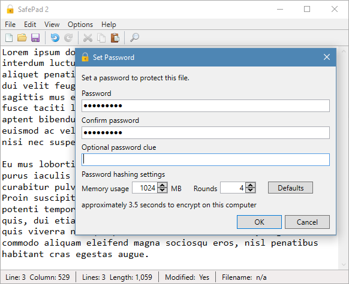

## SafePad 2

[Download SafePad v2.05](https://github.com/Arjailer/arjailer.github.io/releases/download/SafePad-2/SafePad.2.Setup.exe)
 
11 February 2020, ~2MB

_SafePad 2 needs [.NET Framework 4.7.2 Runtime](https://dotnet.microsoft.com/download/dotnet-framework) or later, on 64-bit Windows 7 or later_

---

 

SafePad 2 is an encrypted text editor for 64-bit Windows.

It uses [AES256](https://en.wikipedia.org/wiki/Advanced_Encryption_Standard) encryption with [Argon2](https://en.wikipedia.org/wiki/Argon2) password hashing.

